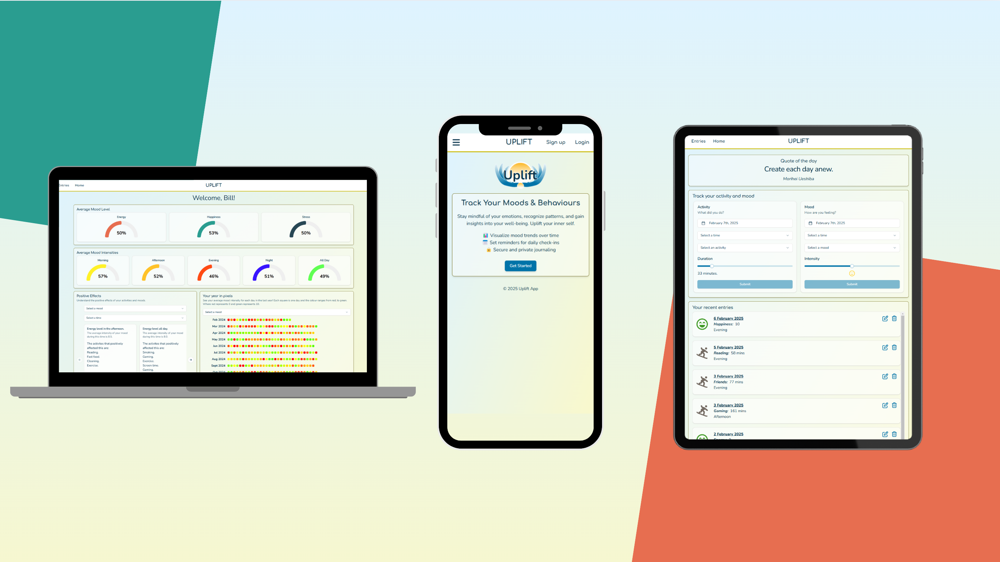

# Uplift



Uplift is a mood and behavior tracking app that allows users to log their emotions and behaviors over time. The app provides simple analysis of this data and presents it in an easy-to-view format, helping users gain insights into their patterns and overall well-being.

## Features

- Track daily moods and behaviors

- View simple analysis and insights

- User-friendly interface for easy data entry

- Secure and private data handling

## Demo

To see the app in action, have a look at this [demo video](https://youtu.be/cIFsfbwOCHA){:target="\_blank"}.

## Tech Stack

**Frontend**: React with Vite, Typescript ShadCN, TailwindCSS, Vitest, Clerk authentication

**Backend**: Express, Typescript, MongoDB with Mongoose, Jest, Clerk authentication, Python with the Pandas package for data analysis

## Installation

To install and run Uplift locally, follow these steps:

### Prerequisites

- Ensure you have [Node.js](https://nodejs.org/){:target="\_blank"} installed on your machine

- [npm](https://www.npmjs.com/){:target="\_blank"} should be available as part of Node.js

- Install [MongoDB](https://www.mongodb.com/){:target="\_blank"} and ensure it is running

- Install [Python](https://www.python.org/){:target="\_blank"} and set up a virtual environment following the instructions in this [README.md](server/scripts/README.md).

- You will need an account with [Clerk](https://clerk.com/){:target="\_blank"} in order to run this app.

### Setup

1. Clone the repository:

   ```
   git clone https://github.com/your-username/uplift.git
   cd uplift
   ```

2. Set up a Python virtual environment. This can be achieved by following the instructions outlined in the [README.md](server/scripts/README.md) file found in the `server/scripts` folder. This can be reached using the following command:

   ```
   cd server/scripts
   cat README.md //Or your preferred text editor
   ```

3. Install dependencies for both the server and client (from the root of the app):

   ```
   cd server
   npm install

   cd ../client
   npm install
   ```

4. Set up environment variables:

   - Create a `.env` file in both the `server` and `client` folders

   - Define the necessary environment variables (e.g., database URL, API keys, etc.)

   - You will need to define the `CLERK_PUBLISHABLE_KEY` & `CLERK_SECRET_KEY` in the server `.env `file and `VITE_CLERK_PUBLISHABLE_KEY` in the client .env file. These are obtained from your dashboard on [Clerk](https://clerk.com/){:target="\_blank"} via the `configure` tab under `API keys`.

   - Whilst [Clerk](https://clerk.com/){:target="\_blank"} provides built in routes for login and sign up, these can be configured via the dashboard to the app's built in routes.

   - ```
     /login
     /register
     ```

   - Finally create a new blank JWT template on [Clerk](https://clerk.com/){:target="\_blank"} with the name `default` and the claims of:

     ```
     {
     	"email": "{{user.primary_email_address}}",
     	"username": "{{user.username}}"
     }
     ```

5. Run the application:

   ```
   cd server
   npm run dev
   ```

   In a separate terminal window:

   ```
   cd client
   npm run dev
   ```

## Usage

1. Open the app in your browser (usually at `http://localhost:5173/`).

2. Log your mood and behaviors.

3. View insights and trends based on your data.

## Contributors

- <div style="display: flex; align-items: center; gap: 10px;">
    Andrew Bark
    <a href="https://github.com/Andrew-Bark">
      
    </a>
    <a href="https://www.linkedin.com/andrew-bark">
      
    </a>
  </div>
- <div style="display: flex; align-items: center; gap: 10px;">
    Bill Haigh
    <a href="https://github.com/Billhaigh13">
      
    </a>
    <a href="https://www.linkedin.com/in/billhaigh/">
      
    </a>
  </div>
- <div style="display: flex; align-items: center; gap: 10px;">
    Burak Tas
    <a href="https://github.com/b-rak">
      
    </a>
    <a href="https://www.linkedin.com/in/tas-burak/">
      
    </a>
  </div>
- <div style="display: flex; align-items: center; gap: 10px;">
    Tommy White
    <a href="https://github.com/TWhite147">
      
    </a>
    <a href="https://www.linkedin.com/in/tommy-white-software/">
      
    </a>
  </div>

## Contributing

If you'd like to contribute to Uplift, feel free to fork the repository and submit a pull request.
